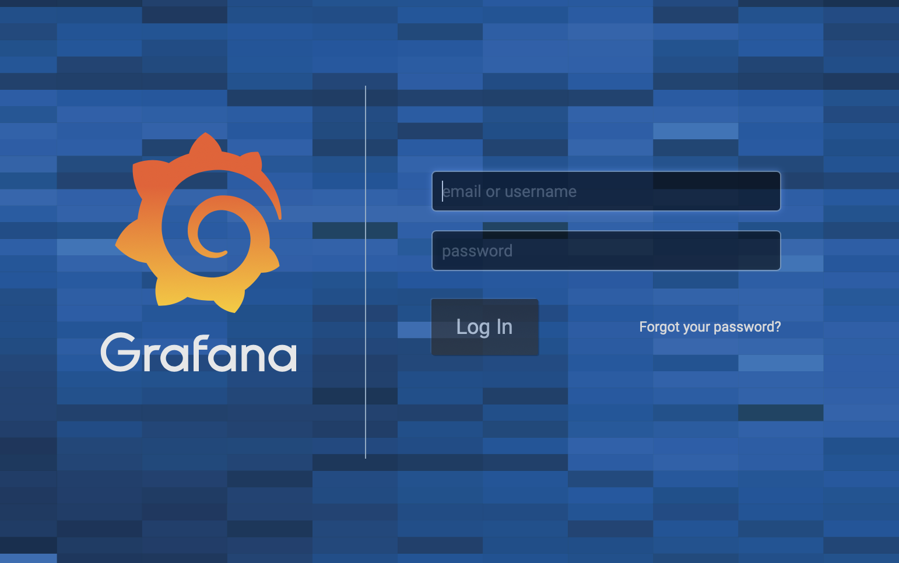
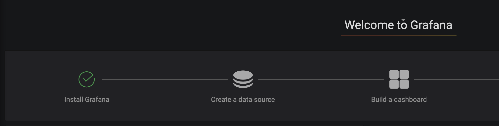
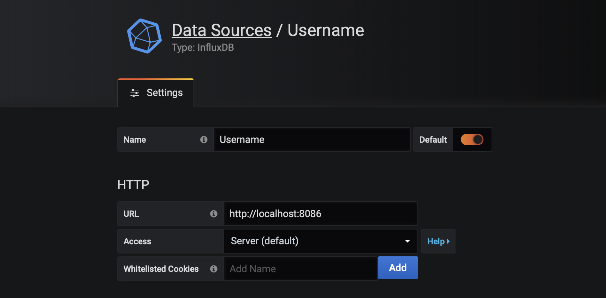
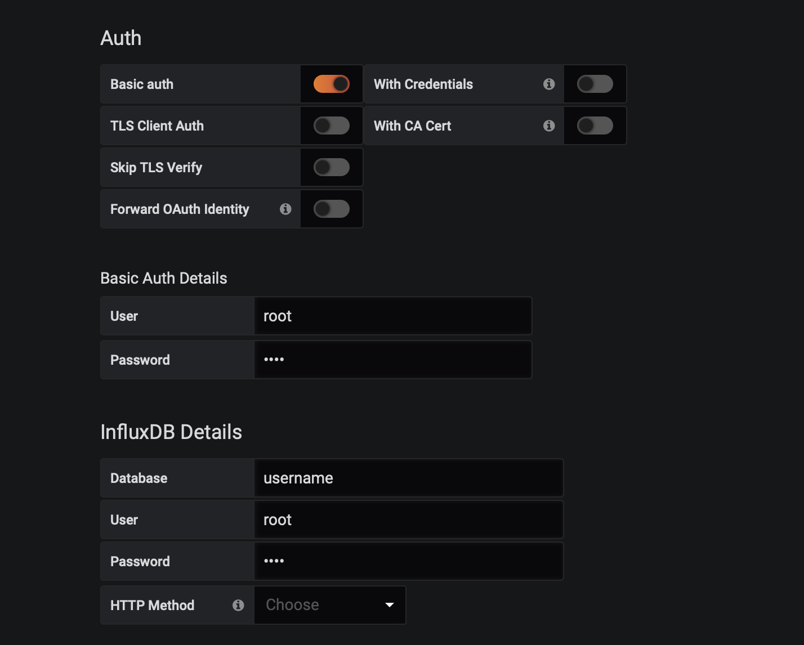
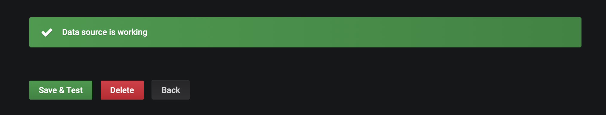
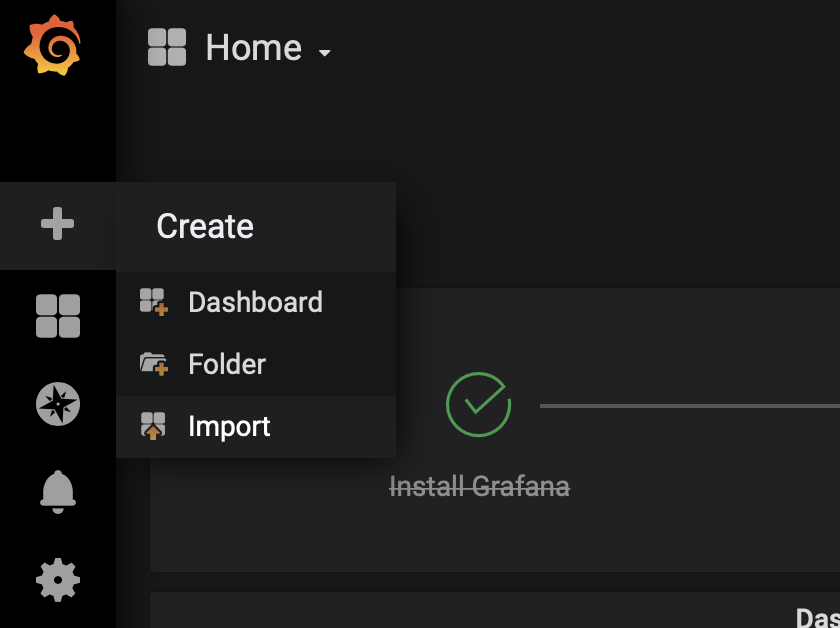
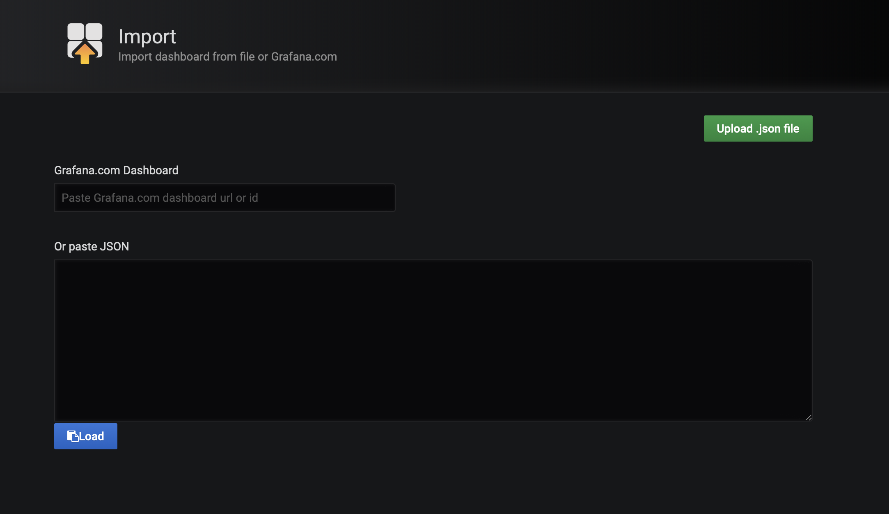
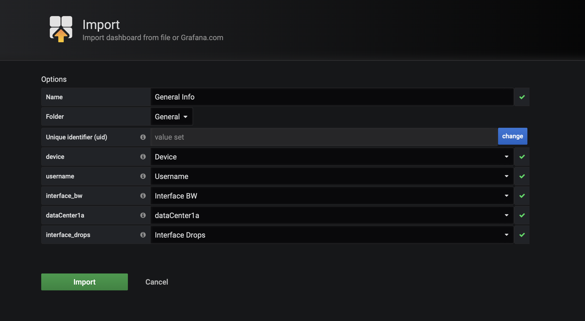
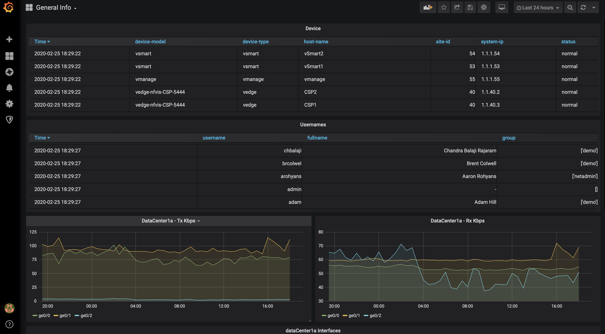

### Day2-After-Tomorrow
CodeFest 2020 submission

### Project Day2-After Tomorrow

We will use Python to poll a production vManage server for existing environmental, topological, and logical constructs of the fabric and present them to the user in an easy to consume manner. The goal will be to provide a straight-forward interface that allows the customer to quickly monitor the health of their SD-WAN environment and be alerted to urgent messages.  You will do this by running a python script to retrieve data from vManage, store that data into an influxDB database, and display the data in a grafana dashboard.

-- Future functionality

### Requirements

To use this application you will need:

* Python 3.7.5
* Cisco SD-WAN 18+
* Windows or OSX device

### Install and Setup

Prepare your local host by following the instructions found here https://github.com/logarby/Day2-After-Tomorrow/blob/master/computer_setup

Clone the code to your local machine.

```
git clone https://github.com/logarby/Day2-After-Tomorrow
cd Day2-After-Tomorrow
```

Setup Python Virtual Environment (requires Python 3.7+)

```
python3.7 -m venv venv
source venv/bin/activate
pip install -r requirements.txt
```

Setup local environment variables for your Cisco SD-WAN fabric. Provide the info for your Cisco SD-WAN environment.  Execute the following commands in bash in you virtual environment and then execute the env_var_check.py script to verify your environmental variables are set..  A good test case is the public vManage hosted by Cisco at available at sdwandemo.cisco.com

Example:

```
export vmanage_host=sdwandemo.cisco.com
export vmanage_port=8443
export username=demo
export password=demo
```

### Using the application

Once installed and setup, you can now run the script sdwan.py

```
python sdwan.py
```

OUTPUT should look something like this

```
Clearing databases
Creating databases
Device write points #: 23
Username write points #: 45
interface BW write points #: 144
Interface Drops write points #: 144
DC 1a write points #: 14

```

### Grafana

Log into Grafana (http://localhost:3000) with the default credentials (username: admin, password: admin):



Once logged in, we need to create our data sources. We will create a data source for each of the databases created by sdwan.py. There should be five total (username, device, interface BW, interface drops, dataCenter1a).

Click “Create a data source”:



Enter the inputs as shown:




Click “Save & Test” and validate that the Data Source is loaded:



Repeat this process for each data store (username, device, interface BW, interface drops, dataCenter1a)

Now click the "+" on the bar to the left and "import":



Click "Upload .json file" and upload the dashboard.json file:



Select the appropriate data stores then click "Import":



Your dashboard should look like the following:



